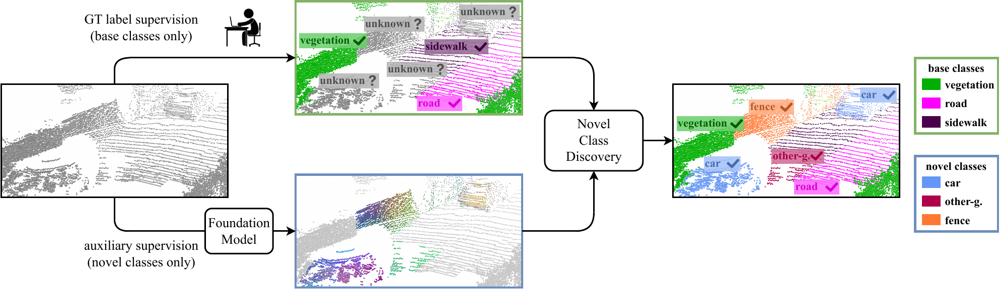

# Novel class discovery meets foundation models for 3D semantic segmentation
Official implementation of the IJCV-SI paper "Novel class discovery meets foundation models for 3D semantic segmentation"



## Introduction
The task of Novel Class Discovery (NCD) in semantic segmentation involves training a model to accurately segment unlabelled (novel) classes, using the supervision available from annotated (base) classes. 
The NCD task within the 3D point cloud domain is novel, and it is characterised by assumptions and challenges absent in its 2D counterpart. 
This paper advances the analysis of point cloud data in four directions. 
Firstly, it introduces the novel task of NCD for point cloud semantic segmentation. 
Secondly, it demonstrates that directly applying an existing NCD method for 2D image semantic segmentation to 3D data yields limited results. 
Thirdly, it presents a new NCD approach based on online clustering, uncertainty estimation, and semantic distillation. 
Lastly, it proposes a novel evaluation protocol to rigorously assess the performance of NCD in point cloud semantic segmentation. 
Through comprehensive evaluations on the SemanticKITTI, SemanticPOSS, and S3DIS datasets, our approach show superior performance compared to the considered baselines.

Authors: 
        [Luigi Riz](https://scholar.google.com/citations?user=djO2pVUAAAAJ&hl),
        [Cristiano Saltori](https://scholar.google.com/citations?user=PID7Z4oAAAAJ&hl),
        [Yiming Wang](https://scholar.google.co.uk/citations?user=KBZ3zrEAAAAJ),
        [Elisa Ricci](https://scholar.google.ca/citations?user=xf1T870AAAAJ&hl),
        [Fabio Poiesi](https://scholar.google.co.uk/citations?user=BQ7li6AAAAAJ&hl)


## Installation

The code has been tested with Python 3.8, CUDA 11.3, pytorch 1.10.1 and pytorch-lighting 1.4.8. Any other version may require to update the code for compatibility.

### Conda
To run the code, you need to install:
- [Pytorch 1.10.1](https://pytorch.org/get-started/previous-versions/)
- [Minkowski Engine](https://github.com/NVIDIA/MinkowskiEngine)
- [Pytorch-Lighting 1.4.8](https://www.pytorchlightning.ai) (be sure to install torchmetrics=0.7.2)
- [Scipy 1.7.3](https://scipy.org/install/)
- [Wandb](https://docs.wandb.ai/quickstart)

## Data preparation
To download the data follow the instructions provided by [SemanticKITTI](http://www.semantic-kitti.org),  [SemanticPOSS](http://www.poss.pku.edu.cn/semanticposs.html) and [S3DIS](http://buildingparser.stanford.edu/dataset.html). Then, use this structure of the folders for SemanticKITTI and SemanticPOSS:
```
./
├── 
├── ...
└── path_to_data_shown_in_yaml_config/
      └── sequences
            ├── 00/           
            │   ├── velodyne/	
            |   |	   ├── 000000.bin
            |   |	   ├── 000001.bin
            |   |	   └── ...
            │   └── labels/ 
            |          ├── 000000.label
            |          ├── 000001.label
            |          └── ...
            └── ...
```
Use this structure for S3DIS:
```
./
├── 
├── ...
└── path_to_data_shown_in_yaml_config/
      └── Area1
            ├── labels/           
            │   ├── conferenceRoom_1.npy
            |   ├── conferenceRoom_2.npy
            |   └──...
            └── points/ 
                ├── conferenceRoom_1.npy
                ├── conferenceRoom_2.npy
                └──...
```

## Commands
### Discovery
To run the discovery step:
```
python main_discover.py -s [SPLIT NUMBER] --dataset [SemanticPOSS, SemanticKITTI, S3DIS]
```
For additional command line arguments, run:
```
python main_discover.py -h
```
To reproduce the paper results run:

```
python main_discover.py -s [SPLIT NUMBER] --dataset SemanticPOSS --dataset_config config/semposs_dataset.yaml --downsampling=60000 --voxel_size=0.05 --batch_size=4 --num_heads=5 --overcluster_factor=3 --use_scheduler --epochs=10 --adapting_epsilon_sk --use_uncertainty_queue --use_uncertainty_loss --uncertainty_percentile=0.3 --clip_path=clip_chkpts/nuscenes_openseg.pth.tar --clip_weight=7.0
```
```
python main_discover.py -s [SPLIT NUMBER] --dataset SemanticKITTI --dataset_config config/semkitti_dataset.yaml --downsampling=80000 --voxel_size=0.05 --batch_size=4 --num_heads=5 --overcluster_factor=3 --use_scheduler --epochs=10 --adapting_epsilon_sk --use_uncertainty_queue --use_uncertainty_loss --uncertainty_percentile=0.5 --clip_path=clip_chkpts/nuscenes_openseg.pth.tar --clip_weight=3.0
```
```
python main_discover.py -s [SPLIT NUMBER] --dataset S3DIS --dataset_config config/s3dis_dataset.yaml --downsampling=80000 --voxel_size=0.025 --batch_size=2 --num_heads=5 --overcluster_factor=3 --use_scheduler --epochs=50 --queue_start_epoch=10 --warmup_epochs=20 --adapting_epsilon_sk --use_uncertainty_queue --use_uncertainty_loss --uncertainty_percentile=0.3 --clip_path=clip_chkpts/scannet_openseg.pth.tar --clip_weight=7.0
```

Checkpoints to be placed in the `clip_chkpts` folder are available for downlaod in the official [OpenScene](https://github.com/pengsongyou/openscene) repository.

## Citing our work

Please cite the following paper if you use our code:

```latex
@article{riz2024snops,
  title={Novel Class Discovery for 3D Point Cloud Semantic Segmentation},
  author={Riz, Luigi and Saltori, Cristiano and Wang, Yiming and Ricci, Elisa and Poiesi, Fabio},
  journal={International Journal of Computer Vision}
  pages={1--22},
  year={2024},
  publisher={Springer}
}
```

## Acknowledgements

This project has received funding from the European Union’s Horizon Europe research and innovation programme under the projects AI-PRISM (grant agreement No. 101058589) and FEROX (grant agreement No. 101070440). This work was also partially sponsored by the PRIN project LEGO-AI (Prot. 2020TA3K9N), EU ISFP PRECRISIS (ISFP-2022-TFI-AG-PROTECT-02-101100539), PNRR ICSC National Research Centre for HPC, Big Data and Quantum Computing (CN00000013) and the FAIR - Future AI Research (PE00000013), funded by NextGeneration EU.
It was carried out in the Vision and Learning joint laboratory of FBK and UNITN.
